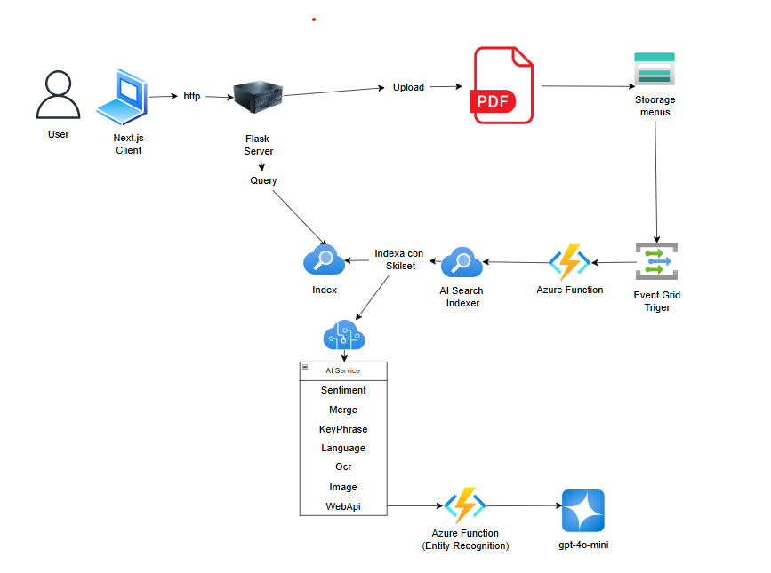

# Proyecto de Procesamiento e Indexación de Documentos con Análisis de IA

Este proyecto permite la carga, almacenamiento, indexación y análisis de documentos en formato PDF mediante una arquitectura basada en Azure. La aplicación ofrece tanto la posibilidad de subir documentos como la de realizar consultas en el índice de búsqueda.

## Descripción General de la Arquitectura

Diagrama de arquitectura

La arquitectura está compuesta por los siguientes componentes:

1. **Interfaz de Usuario (Next.js Client)**

   - Permite a los usuarios subir archivos PDF.
   - Ofrece una interfaz para buscar en el índice y recuperar información procesada.

2. **Servidor Backend (Flask)**

   - Maneja la carga y envío de archivos a Azure Storage.
   - Procesa consultas de búsqueda y recupera información indexada.

3. **Azure Storage (Storage Menus)**

   - Almacena los archivos PDF subidos por los usuarios.
   - Dispara eventos de carga mediante **Event Grid Trigger**.

4. **Event Grid Trigger**

   - Detecta la carga de nuevos documentos y activa una **Azure Function** para su procesamiento.

5. **Azure Function**

   - Procesa los documentos subidos y los envía al **Azure AI Search Indexer**.
   - Extrae metadatos y estructura la información para la indexación.

6. **Azure AI Search Indexer**

   - Usa un Skillset para analizar el documento y extraer información clave.
   - Indexa el contenido del documento en un índice de búsqueda.

7. **Azure AI Service**

   - Aplica análisis de texto y procesamiento de imagen sobre los documentos.
   - Incluye las siguientes capacidades:
     - **Análisis de Sentimiento**
     - **Extracción de Frases Clave**
     - **Detección de Idioma**
     - **OCR (Reconocimiento de Texto en Imágenes)**
     - **Análisis de Imágenes**
     - **Procesamiento mediante Web API Azure Function (Reconocimiento de Entidades)**

## Flujo de Trabajo

1. **Carga de documentos:**

   - Un usuario sube un archivo PDF desde la interfaz web (Next.js).
   - El servidor Flask recibe el archivo y lo sube a **Azure Storage**.

2. **Procesamiento e indexación:**

   - El evento de carga activa **Event Grid**, que dispara una **Azure Function**.
   - La Azure Function extrae el contenido del documento y lo envía al **Azure AI Search Indexer**.
   - El **Skillset de Azure AI Search** analiza el texto, extrae entidades, detecta idioma y clasifica el contenido.

3. **Consulta de documentos:**

   - Los usuarios pueden realizar consultas sobre el contenido indexado desde la interfaz web.
   - Flask recibe las consultas y recupera la información desde el **índice de Azure AI Search**.
   - Los resultados son enviados de vuelta a la interfaz para su visualización.

Esta arquitectura permite una búsqueda rápida y precisa de la información contenida en los documentos, mejorando la accesibilidad y el procesamiento de grandes volúmenes de datos en la nube.

